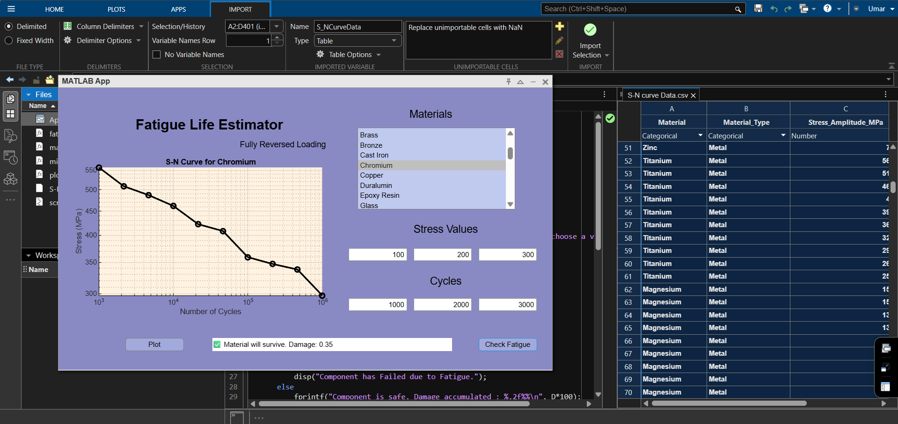

# Fatigue-Life-Estimator-MATLAB
An interactive MATLAB app to estimate fatigue life using S-N curve data for metals, alloys, polymers, and ceramics.
## Features
- Realistic S-N curve plotting using Basquin's Law
- Supports metals, alloys, polymers, and ceramics
- User input validation and real-time fatigue failure check
- CSV-based material database

## Screenshot

## Run Instructions
1. Open the `.mlapp` file in MATLAB App Designer.
2. Load the provided CSV.
3. Push the Plot button to load the Materials List.
4. Select an Material to Plot the SN curve.
5. Now enter your test stress-number of cycles to check if the material survives.

## Data Source
The data is theoretically modeled using material fatigue laws (Basquin equation) and includes realistic variations.

## License
MIT
